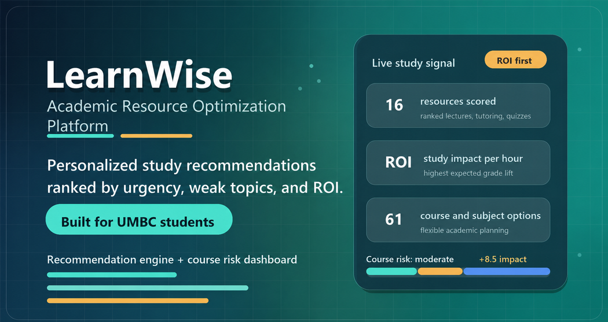

# LearnWise

LearnWise is an academic resource optimization platform for UMBC students that helps them decide which study resources will help them most right now. Instead of only generating content, it ranks study actions by expected impact, time required, urgency, learning preference, course subject, and topic weakness.

## Live Demo

[Open LearnWise](https://jasonbinong.github.io/LearnWise/)

## What It Does

LearnWise acts like a decision-support tool for studying. A student enters course context, available study time, topic weakness, academic urgency, and preferred learning style, then receives ranked recommendations designed to make limited study time more effective.

## Features

- Personalized study resource recommendations
- Support for UMBC-style course codes and subject areas across computing, math, science, business, humanities, social science, health, education, languages, writing, and arts
- Custom course-code entry for courses such as CMSC 201, BIOL 302, IS 147, ENGL 100, HAPP 300, and more
- Resource effectiveness scoring
- Academic ROI per hour calculation
- Course success risk estimate
- Strategy brief explaining why the top plan works
- Deadline-aware study schedule based on available days and hours
- Saved local study-plan history for comparing course risk, planned hours, topics, and first action over time
- Copyable and downloadable study plan export
- Study goal and resource access filters
- Feedback loop that updates learner preferences in the browser
- GitHub Pages-ready static web app

## How To Run

Open `index.html` in a web browser.

No installation is required.

## Project Goal

Students often have access to lecture slides, textbook chapters, videos, tutoring, office hours, writing support, library resources, and practice problems, but they do not know which option gives the best return on limited study time. LearnWise works as a decision-support system that recommends the highest-value academic resources for each situation.

## Tech Stack

- HTML
- CSS
- JavaScript
- Browser localStorage

## What This Project Shows

- Recommendation logic for academic planning
- Student-centered information systems design
- Data-driven prioritization using urgency, time, preference, and impact
- Frontend product design for education technology

## Case Study

### Problem

Students often have access to many academic resources, including lectures, tutoring, office hours, videos, practice problems, writing support, and textbook chapters. The challenge is deciding which resource will help most when time is limited.

### Solution

LearnWise ranks study resources based on course context, weak topics, current grade, time available, deadline pressure, learning style, study goal, and resource access. Instead of giving generic study advice, it recommends the highest-impact actions for the student's situation.

### Key Design Decisions

- Starts with a blank study profile so the recommendations are based on the user's actual course and goals
- Supports UMBC-style courses and broad subject categories
- Scores resources by ROI per hour, urgency, topic match, learning preference, and expected academic impact
- Turns the ranked output into an actionable strategy brief and schedule so students know exactly what to do next
- Saves recent plans locally so students can compare how their study strategy changes across courses and deadlines
- Exports a plain-text study plan that can be saved, shared, or pasted into a calendar/task manager
- Includes a feedback loop that updates the learner profile locally after resource ratings

### What I Learned

This project helped me practice recommendation logic, user-centered design, and academic decision support. It also showed me how information systems can help students choose between competing resources, not just store course information.

### Future Improvements

- Add user accounts and saved semester plans
- Store resource and course data in SQL
- Connect to real tutoring, writing center, and office-hour schedules
- Add analytics for topic mastery and resource effectiveness
- Add calendar export for study sessions

## Future Improvements

- Add user accounts
- Store course/resource data in SQL
- Import the live UMBC course catalog from an official source
- Connect to real campus tutoring and office-hour schedules
- Use an LLM to generate custom quizzes and study-plan explanations
- Add analytics dashboards for topic mastery and resource demand
